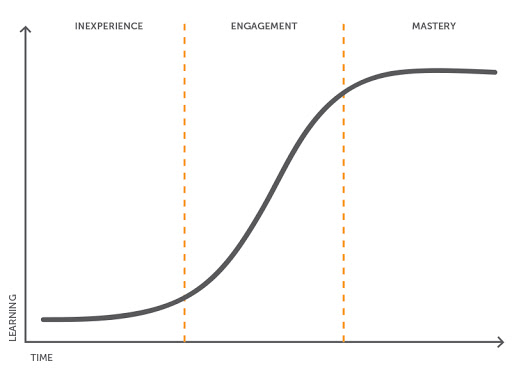

layout: true

.signature[@algogrit]

---

class: center, middle

# SQL for Python Developers

Gaurav Agarwal

---

# Agenda

- Data is the new oil, and **SQL** is the drill

---

class: center, middle


Software Engineer & Product Developer

Director of Engineering & Founder @ https://codermana.com

ex-Tarka Labs, ex-BrowserStack, ex-ThoughtWorks

---

## As an instructor

- I promise to

  - make this class as interactive as possible

  - use as many resources as available to keep you engaged

  - ensure everyone's questions are addressed

---

## What I need from you

- Be vocal

  - Let me know if there are any audio/video issues ASAP

  - Feel free to interrupt me and ask me questions

- Be punctual

- Give feedback

- Work on the exercises

- Be *on mute* unless you are speaking

---
class: center, middle

## Class progression



---
class: center, middle

Here you are trying to *learn* something, while here your *brain* is doing you a favor by making sure the learning doesn't stick!

---

### Some tips (1/2)

- Slow down => stop & think
  - listen for the questions and answer

- Do the exercises
  - not add-ons; not optional

- There are no dumb questions!

- Drink water. Lots of it!

.caveat[continued...]

---

### Some tips (2/2)

- Take notes
  - Try: *Repetitive Spaced Out Learning*

- Talk about it out loud

- Listen to your brain

- *Experiment!*

.caveat[...continued]

---
class: center, middle

### 📚 Content ` > ` 🕒 Time

---
class: center, middle

## Show of hands

*Yay's - in Chat*

---
class: center, middle

## Python Database landscape?

---
class: center, middle

### DB API 2.0 Specification

.content-credits[https://peps.python.org/pep-0249/]

---
class: center, middle

The Python Database API (DB-API) is the standard interface for connecting to databases in Python

---
class: center, middle

It's independent of database engines, so Python scripts can access any database engine

---
class: center, middle

### DB Drivers

---
class: center, middle

Database (DB) drivers are software components that allow applications to interact with database management systems (DBMS) using specific protocols or interfaces

---
class: center, middle

These drivers act as intermediaries, translating queries from an application into commands that the database understands, and then converting the database's responses back into a format usable by the application

---
class: center, middle

#### Synchronous Drivers

---
class: center, middle

`psycopg`

.content-credits[https://github.com/psycopg/psycopg]

---
class: center, middle

The most popular PostgreSQL adapter for Python. It's feature-rich, mature, and widely used in production

---

- Full compliance with the Python DB-API 2.0

- Support for prepared statements, server-side cursors, and `COPY` commands

- Extensive support for PostgreSQL data types

- Thread-safe for use with multiple connections

---
class: center, middle

`pg8000`

.content-credits[https://github.com/tlocke/pg8000]

---
class: center, middle

A pure-Python PostgreSQL driver (doesn’t rely on C extensions)

---

- Easy to deploy since it has no external dependencies

- Fully DB-API 2.0 compliant

---
class: center, middle

#### Asynchronous Drivers

---
class: center, middle

Async drivers are designed for non-blocking I/O and are suitable for asynchronous frameworks like [`asyncio`](https://docs.python.org/3/library/asyncio.html)

---
class: center, middle

`asyncpg`

.content-credits[https://github.com/MagicStack/asyncpg]

---
class: center, middle

A high-performance asynchronous PostgreSQL client library

---
class: center, middle

`asyncpg` implements PostgreSQL server protocol natively and exposes its features directly, as opposed to hiding them behind a generic facade like `DB-API`

.content-credits[https://github.com/MagicStack/asyncpg?tab=readme-ov-file#features]

---

This enables `asyncpg` to have easy-to-use support for:

- prepared statements

- scrollable cursors

- partial iteration on query results

- automatic encoding and decoding of composite types, arrays, and any combination of those

- straightforward support for custom data types

---
class: center, middle

`aiopg`

.content-credits[https://github.com/aio-libs/aiopg]

---
class: center, middle

Asyncio-based PostgreSQL driver built on `psycopg2`

---

- Provides async functionality while maintaining compatibility with `psycopg`

- Offers coroutine-based connection pools and cursors

---
class: center, middle

Applications transitioning from `psycopg` to async workflows can leverage `aiopg`

---

#### Choosing the Right Driver

- Use `psycopg` for general-purpose, synchronous applications

- Use `asyncpg` for high-performance, async workloads

- Use `pg8000` if you need a pure Python solution without external dependencies

- Use `aiopg` for async workflows with existing `psycopg` experience

---
class: center, middle

### Why ORM?

---
class: center, middle

Object-Relational Mapping (ORM) is a programming technique that allows developers to interact with databases using the object-oriented paradigm rather than writing raw SQL queries

---
class: center, middle

ORM frameworks automate the process of converting data between incompatible systems, specifically between objects in code and rows in a relational database

---
class: center, middle

ORMs abstract the complexity of (simple) SQL, making database operations more intuitive by allowing developers to interact with the database as though it were a set of objects in code

---

- Without ORM (raw SQL):

  ```sql
  SELECT * FROM users WHERE id = 1;
  ```

- With ORM (Python example using SQLAlchemy):

  ```python
  user = session.query(User).get(1)
  ```

---
class: center, middle

ORMs use parameterized queries by default, which helps protect against SQL injection attacks.

---
class: center, middle

### ORM libraries

---
class: center, middle

`SQLAlchemy`

.content-credits[https://www.sqlalchemy.org/]

---
class: center, middle

Works as an abstraction layer, leveraging drivers like `psycopg` or `asyncpg`

---

- SQLAlchemy generates optimized SQL queries and supports lazy loading, eager loading, and batch loading for efficient data fetching.

- The Core API enables precise control over query performance, making it suitable for high-performance applications.

---

SQLAlchemy offers more than just ORM. It includes:

- Core SQL Layer: Provides fine-grained control over SQL queries for high-performance and complex use cases.

- ORM Layer: Allows developers to interact with the database using Python objects, simplifying development.

- Schema Management: Tools for defining, creating, and altering database schemas.

---

SQLAlchemy can be used in two main ways:

- *SQLAlchemy Core*: A lower-level abstraction for constructing and executing raw SQL queries programmatically.

- *SQLAlchemy ORM*: A high-level abstraction that maps Python classes to database tables.

---
class: center, middle

This flexibility makes it suitable for projects ranging from simple applications to highly complex systems.

---
class: center, middle

`Django ORM`

.content-credits[https://docs.djangoproject.com/en/5.1/topics/db/queries/]

---
class: center, middle

Defaults to `psycopg2` for PostgreSQL

---
class: center, middle

`Tortoise ORM`

.content-credits[https://tortoise.github.io/]

---
class: center, middle

Async ORM that works with `asyncpg`

---

#### Limitations of ORMs

- Performance Overhead

  - ORMs can be slower than raw SQL for complex queries, as they generate queries dynamically.

- Learning Curve

  - While ORMs simplify database interactions, understanding how they work under the hood can take time.

- Complex Queries

  - Writing intricate queries might require raw SQL for better control.
    - *Eg*: Complex joins or database-specific optimizations.

- Dependency

  - Applications using an ORM are tied to its API, making migration to another ORM or raw SQL more difficult.

---
class: center, middle

### Schema/Migration Management

---
class: center, middle

`Flyway`

.content-credits[https://documentation.red-gate.com/flyway/getting-started-with-flyway]

---
class: center, middle

A database migration tool that emphasizes simplicity and compatibility with multiple databases.

---
class: center, middle

Uses a file-based approach where migrations are typically written in SQL or Java.

---
class: center, middle

`Alembic`

.content-credits[https://alembic.sqlalchemy.org/en/latest/tutorial.html]

---
class: center, middle

Alembic is a database migrations tool written by the author of SQLAlchemy.

---

- Can emit `ALTER` statements to a database in order to change the structure of tables and other constructs

- Provides a system whereby "migration scripts" may be constructed; each script indicates a particular series of steps that can "upgrade" a target database to a new version, and optionally a series of steps that can "downgrade" similarly, doing the same steps in reverse

- Allows the scripts to execute in some sequential manner

---
class: center, middle

`Atlas`

.content-credits[https://atlasgo.io/]

---
class: center, middle

Atlas is a language-agnostic tool for managing and migrating database schemas using modern DevOps principles.

---

It offers two workflows:

- *Declarative*: Similar to Terraform, Atlas compares the current state of the database to the desired state, as defined in an HCL, SQL, or ORM schema. Based on this comparison, it generates and executes a migration plan to transition the database to its desired state.

- *Versioned*: Unlike other tools, Atlas automatically plans schema migrations for you. Users can describe their desired database schema in HCL, SQL, or their chosen ORM, and by utilizing Atlas, they can plan, lint, and apply the necessary migrations to the database.

---
class: center, middle

## Setup & Getting Started

---

- [Install Postgres](https://www.postgresql.org/download/) (15 & above)

  - Make sure Postgres server is running on your system

- Test using: `psql template1`

- Clone the repo (https://github.com/AgarwalConsulting/SQLforPythonDevelopersTraining)

  - `pip install -r requirements.txt`

---
class: center, middle

## `Psycopg` basics

---
class: center, middle

'%s', '%b', '%t' are the only supported query parameter types

---
class: center, middle

### Connection Pooling with `psycopg`

.content-credits[https://www.psycopg.org/psycopg3/docs/advanced/pool.html]

---
class: center, middle

## `Sqlalchemy` basics

---

- **Core**: Provides a low-level interface for SQL execution.

- **ORM**: Provides an object-oriented abstraction over the database.

---
class: center, middle

### Core connection example

---
class: center, middle

### Sqlalchemy ORM

---
class: center, middle

#### Changes in 2.0

.content-credits[https://docs.sqlalchemy.org/en/20/changelog/migration_20.html#migration-20-query-usage]

---
class: center, middle

#### Using built-in auto-migration support

---
class: center, middle

caveats of using built-in auto-migration support!

---
class: center, middle

## Basic migrations using `alembic`

.content-credits[https://alembic.sqlalchemy.org/en/latest/tutorial.html]

---
class: center, middle

To get started

`alembic init alembic`

---
class: center, middle

To generate new migration

`alembic revision [--autogenerate] -m "<migration message>"`

---
class: center, middle

## ORM: Deep Dive

---
class: center, middle

### Relationships

---

- One to One

- One to Many

- Many to Many

- Self-Referential

- Polymorphic

---
class: center, middle

The dreaded (n+1)

---
class: center, middle

#### Relationship Loading Techniques

.content-credits[https://docs.sqlalchemy.org/en/20/orm/queryguide/relationships.html]

---
class: center, middle

### Raw Queries

---
class: center, middle

### Constraints, validations and events

---
class: center, middle

#### Defining constraints on columns

---
class: center, middle

#### Defining Validations

---
class: center, middle

#### Events

.content-credits[https://docs.sqlalchemy.org/en/20/core/event.html]

---

#### Commonly Used Events

- `before_insert`: Triggered before an object is inserted into the database.

- `after_insert`: Triggered after an object is inserted.

- `before_update`: Triggered before an update operation.

- `after_update`: Triggered after an update operation.

- `before_delete`: Triggered before an object is deleted.

- `after_delete`: Triggered after an object is deleted.

---
class: center, middle

### Default Values

---
class: center, middle

## Advanced Schema Management

---
class: center, middle

## Postgres Basics: Refresher

---
class: center, middle

### Types

.content-credits[https://www.postgresql.org/docs/current/datatype.html#DATATYPE-TABLE]

---
class: center, middle

SERIAL

---
class: center, middle

(Date, Time) vs Timestamp [with Timezone]

---
class: center, middle

### Loading/Dumping csv data

---
class: center, middle

Using `COPY` or `\COPY`

---
class: center, middle

```sql
COPY <tablename> TO '<csv_file>' WITH(FORMAT CSV, HEADER); -- Dumping

COPY <tablename> FROM '<csv_file>' {DELIMITER ','} CSV HEADER; -- Loading
```

---
class: center, middle

## Normalization

---

- 1 NF

- 2 NF

- 3 NF

- BCNF

.content-credits[https://www.simplilearn.com/tutorials/sql-tutorial/what-is-normalization-in-sql]

---
class: center, middle

Let's take an employee management system as an example...

---
class: center, middle

### The problems with flat tables

---

- *Data Redundancy*: Repeated storage of the same data increases storage needs.

- *Data Integrity Issues*: Risk of inconsistencies when updating repeated data.

- *Scalability Challenges*: Tables grow large quickly, impacting performance.

- *Lack of Normalization*: Makes managing relationships between data entities difficult.

- *Limited Query Flexibility*: Complex queries may become inefficient or convoluted.

- *Maintenance Overhead*: Adding or modifying data structures is harder and error-prone.

- *Poor Data Organization*: Difficult to handle hierarchical or multi-dimensional data effectively.

---
class: center, middle

### When **NOT** to Normalize

---

- Performance is the Key Concern

  - Normalization requires more joins to fetch related data, which can slow down read-heavy operations.

- You Have a Read-Heavy Application

  - For applications like reporting or analytics, de-normalized data reduces the need for joins, speeding up queries.

- Storage is Cheap and Plentiful

  - Modern storage costs are low, so eliminating redundancy may not always be worth the effort.

.caveat[(1/2)]

---

- Your Data is Relatively Static

  - If your data rarely changes, you can afford some redundancy without significant risks of anomalies.

- You’re Using a NoSQL Database

  - Document-based databases (e.g., MongoDB) favor denormalized structures for faster read performance and scalability.

.caveat[(2/2)]

---
class: center, middle

### To Normalize or not to Normalize: How to Decide?

---

- **Application Type**

  - Transactional systems (OLTP): Normalize.

  - Analytical systems (OLAP): Often de-normalize.

- **Query Complexity**

  - Normalize when query patterns involve fine-grained data updates or strict constraints.

  - De-normalize when queries are simple but need to run fast.

- **Maintainability vs. Performance**

  - Normalize for long-term maintainability and data consistency.

  - De-normalize for immediate performance gains in specific use cases.

---
class: center, middle


---

### Hybrid Approaches

- Partially Normalize

  - Normalize up to 3NF, then selectively de-normalize performance-critical parts.

- Use Indexing and Materialized Views

  - Optimize performance without sacrificing full normalization by creating indexes or materialized views for frequently used queries.

---
class: center, middle

*Normalize for integrity, de-normalize for speed.*

---
class: center, middle

## Joins

---
class: center, middle


.image-credits[https://medium.com/@kjavaman12/simple-introduction-of-sql-joins-b00a83ab8292]

---
class: center, middle

### Usage of `IN` vs `NOT IN` clauses

---
class: center, middle

#### Differences Between `IN` and `NOT IN`

---

##### Logic

- `IN` returns rows where the value in the column matches any value in the list.

- `NOT IN` returns rows where the value in the column does **not** match any value in the list.

.caveat[(1/3)]

---

##### Performance

- `IN`: Works efficiently when checking against a relatively small list of values.

- `NOT IN`: May not perform as efficiently when dealing with large sets of values or NULL values. This is because `NOT IN` may involve extra checks for `NULL`.

.caveat[(2/3)]

---

##### Handling NULLs

- `IN`: If the subquery contains `NULL`, the result of `IN` can behave unpredictably (e.g., `NULL` values cause the result to be unknown or false in the query).

- `NOT IN`: If any value in the list is `NULL`, the result will be `NULL` for all rows, because any comparison with `NULL` is unknown (this leads to no rows being returned unless the list is carefully handled).

.caveat[(3/3)]

---
class: center, middle

### Alternative with `EXISTS` or `NOT EXISTS`

---
class: center, middle

If you need to handle subqueries more efficiently (especially with `NULL` values), consider using `EXISTS` or `NOT EXISTS` as an alternative to `IN` and `NOT IN`.

---

```sql
SELECT name
FROM employees e
WHERE EXISTS (
    SELECT 1
    FROM departments d
    WHERE e.department_id = d.dept_id
    AND d.department_name = 'HR'
);
```

---
class: center, middle

### Which JOINs to choose?

---
class: center, middle

### JOIN vs UNION

---
class: center, middle


.image-credits[https://www.youtube.com/watch?v=Yh4CrPHVBdE]

---
class: center, middle

## Analyzing Performance using `EXPLAIN` or `EXPLAIN ANALYZE`

---
class: center, middle

## Working with indices

.content-credits[https://www.postgresql.org/docs/current/indexes.html]

---
class: center, middle

### Efficient Postgres: Tips & tricks

---

- Indexing

  - Use appropriate indexes (B-tree, GIN, GiST, etc.) for filtering and sorting.

  - Avoid over-indexing to reduce storage and maintenance overhead.

- Query Design

  - Always specify needed columns (`SELECT col1, col2`), not `SELECT *`.

  - Use `WHERE` clauses to filter data early.

- Joins and Subqueries

  - Optimize join order; smaller or filtered tables should come first.

  - Replace correlated subqueries with joins if possible.

- Query Analysis

  - Use `EXPLAIN` and `EXPLAIN ANALYZE` to inspect execution plans.
  - Identify and address slow sequential scans.

.caveat[(1/3)]

---

- Sorting and Grouping

  - Index columns frequently used for sorting or grouping.

- Maintenance

  - Regularly run [`VACUUM`](https://www.postgresql.org/docs/current/sql-vacuum.html) and `ANALYZE` to update statistics.

  - Enable autovacuum for large, write-heavy tables.

- Partitioning and Parallelism

  - Partition large tables to reduce scanned data.

  - Enable parallel queries for large datasets.

- Avoid Redundancy

  - Avoid applying functions to indexed columns in WHERE clauses. (*Eg*: date(timestamp_col))

.caveat[(2/3)]

---

- Materialized Views

  - Use materialized views for expensive, repetitive queries.

- Connection Pooling

  - Use a pooler like PgBouncer to manage database connections efficiently.

- Performance Monitoring

  - Install `pg_stat_statements` to track query performance.

.caveat[(3/3)]

---
class: center, middle

### Working with JSONB

---
class: center, middle

`JSONB` vs `JSON`

---
class: center, middle

`JSONB` vs `hstore`

---
class: center, middle

#### Storage of JSONB (& other large objects)

.content-credits[https://www.postgresql.org/docs/current/storage-toast.html]

---
class: center, middle

#### Using GIN Indexes

.content-credits[https://www.postgresql.org/docs/current/indexes-types.html#INDEXES-TYPES-GIN]

---
class: center, middle

## Partitioning

---
class: center, middle

Partitioning divides a table into smaller pieces (partitions), which can improve performance for queries and management of large datasets.

---
class: center, middle

In PostgreSQL, there are two main types of partitioning:

- range and

- list

---
class: center, middle

SQLAlchemy allows you to interact with partitioned tables just like any other table, but PostgreSQL automatically handles the routing of rows to the appropriate partition based on the region value.

---
class: center, middle

## Windowing Functions

---
class: center, middle

Windowing functions allow you to perform calculations across a set of rows related to the current row

---
class: center, middle

running totals, rankings, or moving averages.

---
class: center, middle

### CAP theorem

defines the limitations and trade-offs in a distributed system


---

It suggests that distributed computer systems can only deliver two out of the following three guarantees:

**Consistency**: Every node sees the same data even when concurrent updates occur

**Availability**: All requests receive responses on whether it was a success or a failure

**Partition tolerance**: The system will keep operating even if there is a network partition in communication between different nodes

---
class: center, middle

In the case of a network partition, the CAP theorem forces a trade-off between *Consistency* and *Availability*.

---

A system must either:

- Maintain consistency, but sacrifice availability (not all requests are responded to).

- Maintain availability, but sacrifice consistency (some responses may be outdated).

---
class: center, middle

Code
https://github.com/AgarwalConsulting/SQLforPythonDevelopersTraining

Slides
https://sql-for-python-developers.slides.AgarwalConsulting.com
